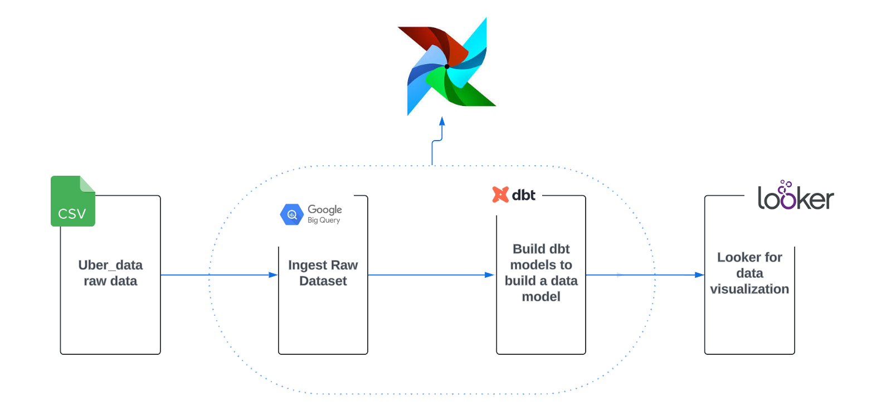
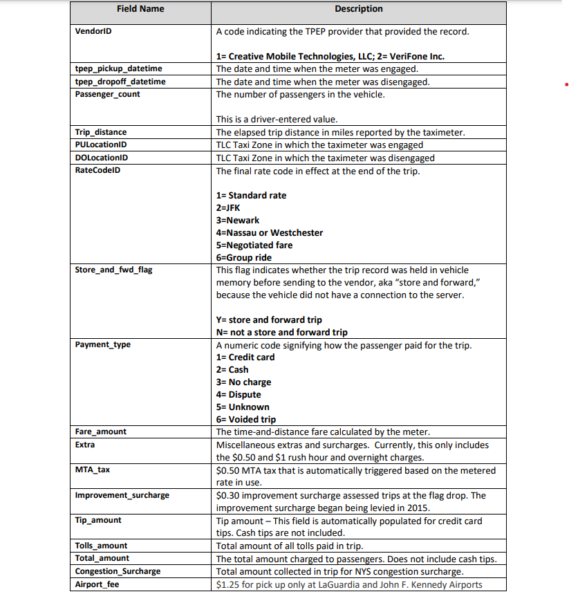
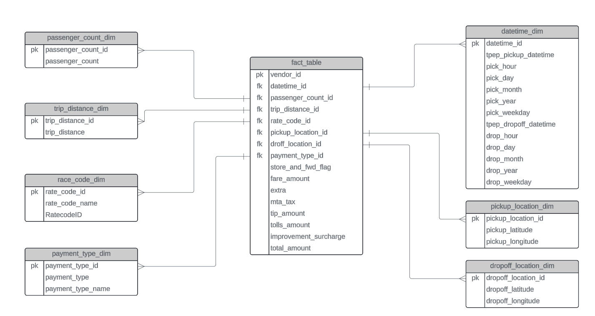

# Uber Data Pipeline and Analysis

This repository contains an end-to-end data pipeline for processing and analyzing Uber trip data. The pipeline ingests raw data, transforms it using Apache Airflow, and loads it into BigQuery for further analysis. The project also includes data modeling with dbt and an interactive dashboard for data visualization.



## Dataset

The dataset used in this project describes yellow taxi trip data in New York City. You can download the dataset from the following link:

- [Dataset Download](https://drive.google.com/file/d/1ZLQCnTG6PbPfBO1pHPCgX4ruu3XXSSpj/view?usp=sharing)

For additional data dictionaries or a map of the TLC Taxi Zones, please visit the [NYC TLC website](http://www.nyc.gov/html/tlc/html/about/trip_record_data.shtml).



## Data Modeling

The data model for the project includes various fact and dimension tables created using dbt:



## Prerequisites

To run this project, ensure you have the following installed:

- Docker
- Astro CLI
- Google Cloud (GC) account

## Setup Steps

### Docker Configuration

1. **Update Dockerfile**: Ensure your Dockerfile uses the following base image:
   - [quay.io/astronomer/astro-runtime:12.0.0](http://quay.io/astronomer/astro-runtime:12.0.0)
   - Restart Airflow using `astro dev restart`.

### Dataset Preparation

1. **Download the dataset**:
   - [Uber Data CSV](https://drive.google.com/file/d/1ZLQCnTG6PbPfBO1pHPCgX4ruu3XXSSpj/view?usp=sharing)
   - Store the CSV file in `include/dataset/uber_data.csv`.

2. **Update requirements.txt**:
   - Add `apache-airflow-providers-google`.
   - Restart Airflow.

### Google Cloud Setup

1. **Create a GCS bucket**:
   - Name: `<your_name>`.

2. **Create a service account**:
   - Name: `<your_name>`.
   - Grant admin access to GCS and BigQuery.
   - Generate and save the service account key as `include/gcp/service_account.json`.

3. **Set up Airflow connection**:
   - Airflow → Admin → Connections.
   - ID: `gcp`.
   - Type: `Google Cloud`.
   - Keypath: `/usr/local/airflow/include/gcp/service_account.json`.
   - Test the connection.

### Airflow DAG Creation

1. **Create the DAG**:

   ```python
   # Uber_data.py

   from airflow.decorators import dag, task
   from datetime import datetime

   from airflow.providers.google.cloud.transfers.local_to_gcs import LocalFilesystemToGCSOperator

   @dag(
       start_date=datetime(2024, 1, 1),
       schedule=None,
       catchup=False,
       tags=['uber_data'],   
   )
   def uber_data():
       upload_csv_to_gcs = LocalFilesystemToGCSOperator(
           task_id='upload_csv_to_gcs',
           src='/usr/local/airflow/include/dataset/uber_data.csv',
           dst='raw/uber_data.csv',
           bucket='uberdata-01',
           gcp_conn_id='gcp',
           mime_type='text/csv',
       )

   uber_data()
   ```

2. **Test the task**:

   ```bash
   astro dev bash
   airflow tasks test uber_data upload_csv_to_gcs 2024-01-01
   ```

3. **Create an empty Dataset**:

   ```python
   from airflow.providers.google.cloud.operators.bigquery import BigQueryCreateEmptyDatasetOperator

   create_uber_data_dataset = BigQueryCreateEmptyDatasetOperator(
           task_id='create_uber_data_dataset',
           dataset_id='uber_data',
           gcp_conn_id='gcp',
       )
   ```

   Test the connection:

   ```bash
   airflow tasks test uber_data create_uber_data_dataset 2024-01-01
   ```

4. **Load file into BigQuery**:

   ```python
   from astro import sql as aql
   from astro.files import File
   from astro.sql.table import Table, Metadata
   from astro.constants import FileType

   gcs_to_raw = aql.load_file(
           task_id='gcs_to_raw',
           input_file=File(
            'gs://uberdata-01/raw/uber_data.csv',
            conn_id='gcp',
            filetype=FileType.CSV,   
           ),
           output_table=Table(
               name='raw_uberdata',
               conn_id='gcp',
               metadata=Metadata(schema='uber_data')
           ),
           use_native_support=False,
       )
   ```

   Test the task:

   ```bash
   airflow tasks test uber_data gcs_to_raw 2024-01-01
   ```

**🏆 Data loaded into the warehouse!**

## Build SQL dbt Models

1. **Run dbt models**:

   ```bash
   astro dev bash
   source /usr/local/airflow/dbt_venv/bin/activate
   cd include/dbt 
   dbt deps
   dbt run --profiles-dir /usr/local/airflow/include/dbt/
   ```

   Verify that the tables exist with data in BigQuery.

2. **Add dbt task**:

   ```python
   from include.dbt.cosmos_config import DBT_PROJECT_CONFIG, DBT_CONFIG
   from cosmos.airflow.task_group import DbtTaskGroup
   from cosmos.constants import LoadMode
   from cosmos.config import ProjectConfig, RenderConfig

   transform = DbtTaskGroup(
           group_id='transform',
           project_config=DBT_PROJECT_CONFIG,
           profile_config=DBT_CONFIG,
           render_config=RenderConfig(
               load_method=LoadMode.DBT_LS,
               select=['path:models/transform']
           )
       )
   ```

3. **Create DBT_CONFIG**:

   ```python
   # include/dbt/cosmos_config.py

   from cosmos.config import ProfileConfig, ProjectConfig
   from pathlib import Path

   DBT_CONFIG = ProfileConfig(
       profile_name='uber_data',
       target_name='dev',
       profiles_yml_filepath=Path('/usr/local/airflow/include/dbt/profiles.yml')
   )

   DBT_PROJECT_CONFIG = ProjectConfig(
       dbt_project_path='/usr/local/airflow/include/dbt/',
   )
   ```

4. **Test dbt task**:

   ```bash
   astro dev bash
   airflow tasks list uber_data
   airflow tasks test uber_data transform.fact_table_run 2024-01-01
   ```

5. **Run the pipeline**:
   - Check the Airflow UI to verify the TaskGroup transform with the models.
   - Trigger the DAG to run the pipeline and create dbt model tables in BigQuery.

## Dashboard

An interactive dashboard will be created on Looker for data analysis.
